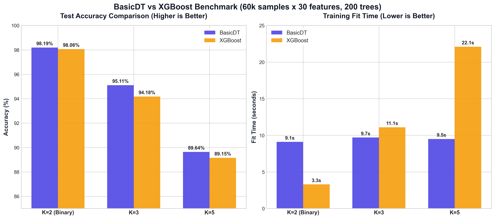

# BasicDT

A standalone, high-performance, histogram-based axis-aligned decision tree engine.

`BasicDT` extracts the optimized pre-binned histogram-based decision tree core from OQBoost, removing all oblique projection, coordinate descent, and random projection logic to deliver pure axis-aligned gradient boosted trees.

---

## Features

- **Extremely Fast**: Employs cache-blocked sample-parallelism and dynamic thread scaling in C++ (OpenMP).
- **Native NaN Handling**: Missing values (NaNs) are automatically handled and imputed during binning.
- **Native Categorical Support**: Supports categorical features out of the box using rank-encoded target gradients.
- **Scikit-Learn Compatible**: Implements standard `fit`, `predict`, and `predict_proba` APIs.
- **Highly Scalable Multiclass**: Uses a shared-tree structure approach that remains flat in execution time as class counts increase.

---

## Benchmark Results (vs XGBoost)

We compared `BasicDT` against off-the-shelf XGBoost (`tree_method="hist"`, `max_bin=256`, matching depth/lr/subsample/lambda) on a synthetic dataset (**60,000 samples, 30 features, 200 estimators**).



| K (Classes) | BasicDT Accuracy | BasicDT Fit Time | XGBoost Accuracy | XGBoost Fit Time | Result |
| :---: | :---: | :---: | :---: | :---: | :---: |
| **K = 2 (Binary)** | **98.19%** | 9.1s | 98.06% | **3.3s** | Accuracy Win, Slower |
| **K = 3** | **95.11%** | **9.7s** | 94.18% | 11.1s | **Accuracy & Speed Win** |
| **K = 5** | **89.64%** | **9.5s** | 89.15% | 22.1s | **Accuracy & Speed Win** |

### Why is BasicDT faster for K $\ge$ 3?
- **Shared Tree Architecture**: Rather than building $K$ separate trees per round like XGBoost, `BasicDT` builds **one shared tree structure** and computes leaf outputs across all $K$ dimensions simultaneously. The split search is paid once, making training times flat-scale across multi-class scenarios.
- **Zero-Allocation Predicts**: Removed all intermediate prediction buffers (`Xt` / `Ximp`). Imputation and category mapping are resolved on-the-fly in routing registers, avoiding memory allocations and cache thrashing.
- **Dynamic Thread Scaling**: Thread count adjusts dynamically based on the number of samples in the current node, reducing OpenMP scheduling overhead on small deep leaf splits.

---

## Installation

```bash
# Clone the repository
git clone https://github.com/CREE1116/BasicDT.git
cd BasicDT

# Install in editable mode
pip install -e .
```

---

## Usage

```python
from basicdt import BasicDTClassifier

# Initialize model
clf = BasicDTClassifier(
    n_estimators=200,
    learning_rate=0.05,
    max_depth=6,
    subsample=0.8
)

# Fit model
clf.fit(X_train, y_train)

# Predict probabilities
probas = clf.predict_proba(X_test)
```
